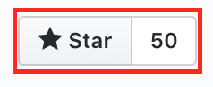

<h3 align="center">Quotes on being a Programmer :tada:</h3>

    
  
  

------------

##### A language that doesn't affect the way you think about programming is not worth knowing.

##### Walking on water and developing software from a specification are easy if both are frozen.

##### The first way you think of is highly unlikely to be the best way.

##### There's always plenty of room for improvement - in your code, in your abilities, in you.

##### A misplaced decimal point will always end up where it will do the greatest damage.

##### A good programmer looks both ways before crossing a one-way street.

##### When debugging, novices insert corrective code; experts remove defective code.

##### Sometimes it good to stay in bed on Monday, rather than spending the rest of the week debugging Monday’s code.

##### Any fool can write code that a computer can understand. Good programmers write code that humans can understand.

##### It´s better to wait for a productive programmer to become available than it is to wait for the first available programmer to become productive.

##### The collective noun for a group of programmers is a merge-conflict.

##### Sometimes it's OK to be a bit of an a**hole. But don't make a habit of it.

##### No one hates software more than software developers.

##### What one programmer can do in one month, two programmers can do in two months.

##### Good code is like a good joke: it needs no explanation.

------------
## Contribution Guidelines

* The quote/thought must be unique
* It must be related with Programming
* A pull request must contain only single quote/thought

------------

If you like this repository, don't forget to star it using star button available at top right like following -

------------

 Quotes on being a Programmer by <a xmlns:cc="http://creativecommons.org/ns#" href="https://github.com/rishiip/rails-interview-questions" property="cc:attributionName" rel="cc:attributionURL">Rishi Pithadiya</a> is licensed under a <a rel="license" href="http://creativecommons.org/licenses/by/3.0/deed.en_US">Creative Commons Attribution 3.0 Unported License</a>.